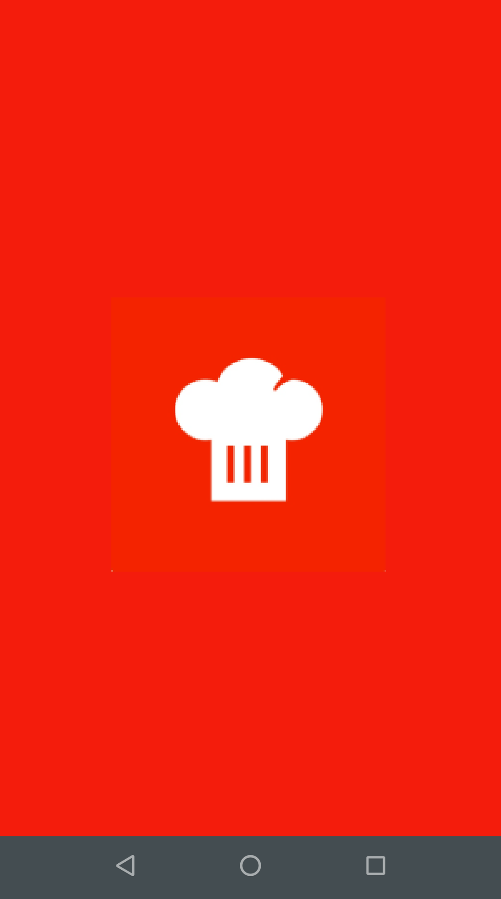
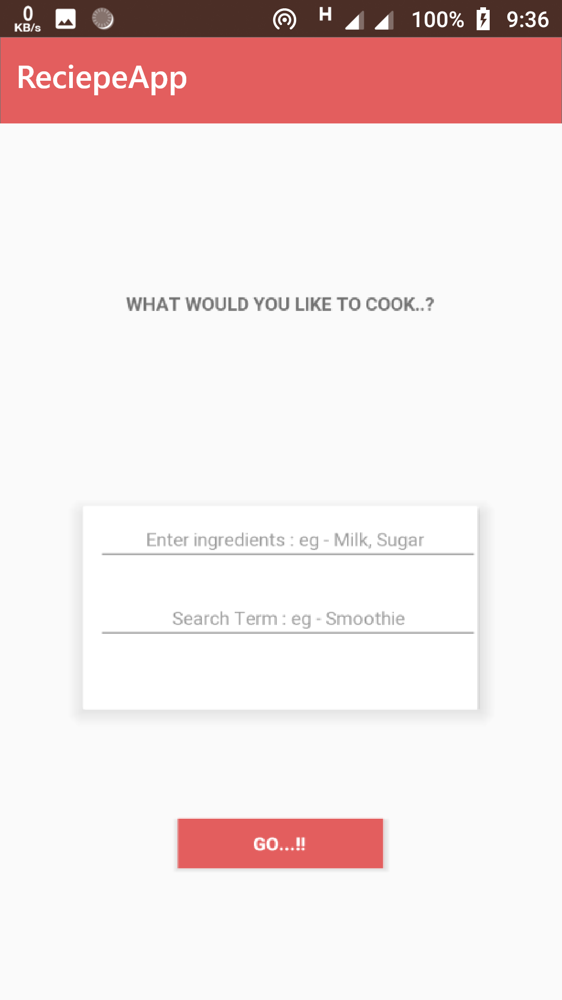
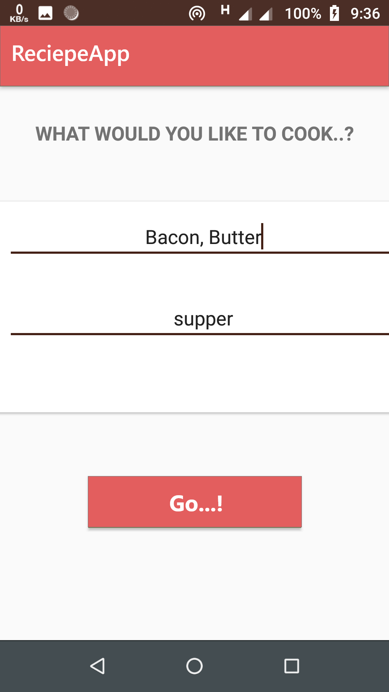
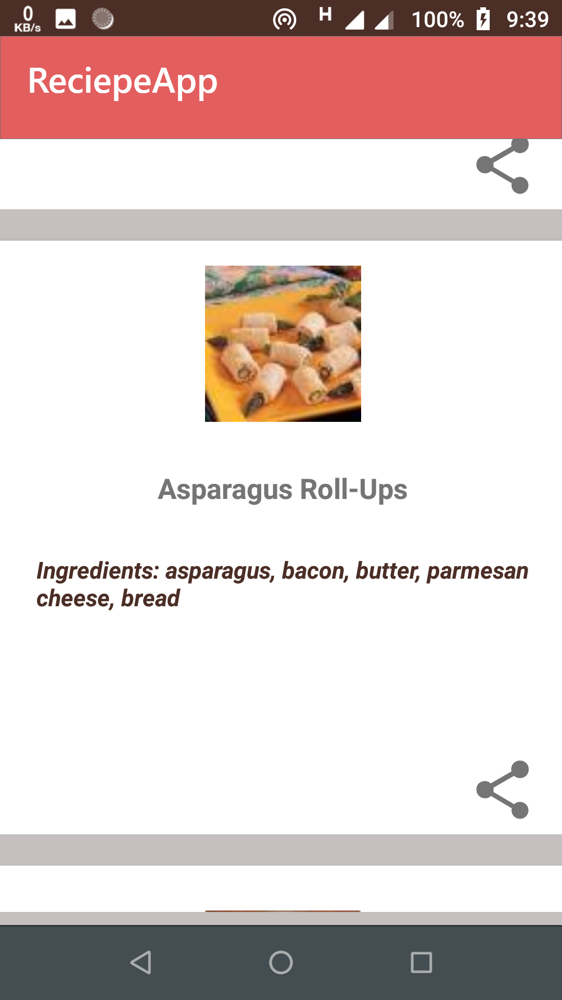
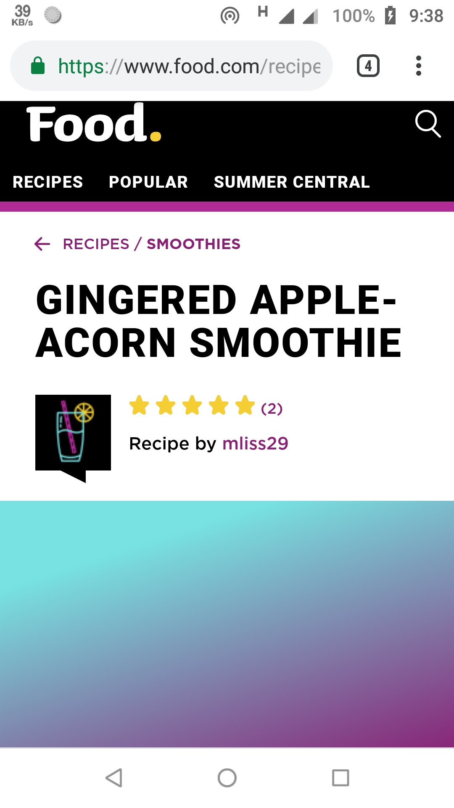

For all the maniacs of cooking and those who have a hidden chef, the Cuisine app provides the recipe for the dish you want to cook with your own ingredients..!!
sounds amazing..??
It uses `Google volley library` along with `picasso` to bring out the image for a dish, also uses `json` for fetching the data
concept of `remote api` is implemented
Also it `redirects to browser` for the details of a particular recipe.

## Platform
        -> Android Studio
        -> With Kotlin Support

## Features

* Google's Volley Library
* Remote API
* Picasso Library
* Recipe Puppy API
* Splash screen
* Custom ListView
* Cardview
* Webview
* ImageView
* Simplified Theme
* Well Constrained Layout

## Screenshots

 
 

 
 

## Accessing tips :

1. Clone or download the repository: `https://github.com/P4NK4J/android_kotlin_Cuisine_app`
2. Navigate to the folder `app` Folder
3. Navigate to the folder `anroid_kotlin_Cuisine_app/app/src/` to access developers content
